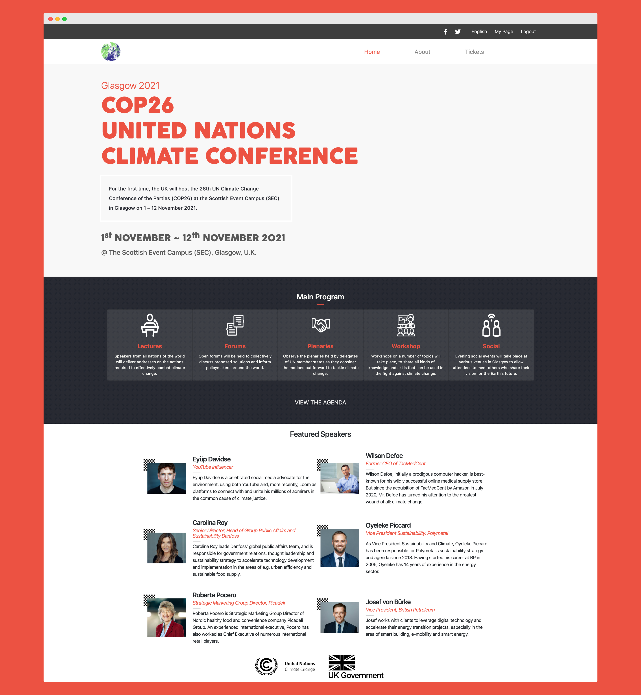

# HTML/CSS Capstone: COP26 UN Climate Conference

> This project is a website for the United Nations Climate Conference taking place in Glasgow in November 2021.

I was given [this design](https://www.behance.net/gallery/29845175/CC-Global-Summit-2015) of [Cindy Shin](https://www.behance.net/gallery/29845175/CC-Global-Summit-2015)'s to follow, mirroring its structure, typography and colors as I built my own conference website.

After some cursory research, I discovered that the next UN "Conference of the Parties" is due to take place in the UK next year, and I decided this would be the conference for which I would build my website.

## Built With

- HTML/CSS
- Bootstrap
- SASS
- VSCode
- Google Chrome
- MacOS

## Live Demo

[Live Demo Link](https://practical-lewin-9eb5ef.netlify.app/main.html)

## Getting Started

**To get this project set up on your local machine, follow these simple steps:**

1. Open Terminal.

2. Navigate to your desired location to download the contents of this repository.

3. Copy and paste the following code into the Terminal:

    git clone https://github.com/Joseph-Burke/COP26-Conference-Page

4. Hit enter.

5. Once the repository has been cloned, open main.html in a browser of your choosing. From there, you may also navigate to the "About" and "Tickets" pages.

6. Enjoy!

### Prerequisites

- A computer, a smartphone, or another similar device.
- Access to the internet.

## Author

👤 **Joe Burke**

> Hello, World! 
My name's Joe. Hire me!
- Github: [@Joseph-Burke](https://github.com/Joseph-Burke)
- Twitter: [@__joeburke](https://twitter.com/__joeburke)
- Linkedin: [Joseph Burke](https://www.linkedin.com/in/joseph-burke-b7a8261a5)

## 🤝 Contributing

Contributions, issues and feature requests are always welcome!

I'm love meeting other developers, especially ones that give me advice on how to improve my work.

Drop me an [issue](issues/)!

## Show your support

Finally, if you've read this far, don't forget to give this repo a ⭐️. They're free . . . I think.

## Acknowledgments

- Thanks are owed to the designer, 
- Inspiration
- etc

## 📝 License

This project is [MIT](lic.url) licensed.
