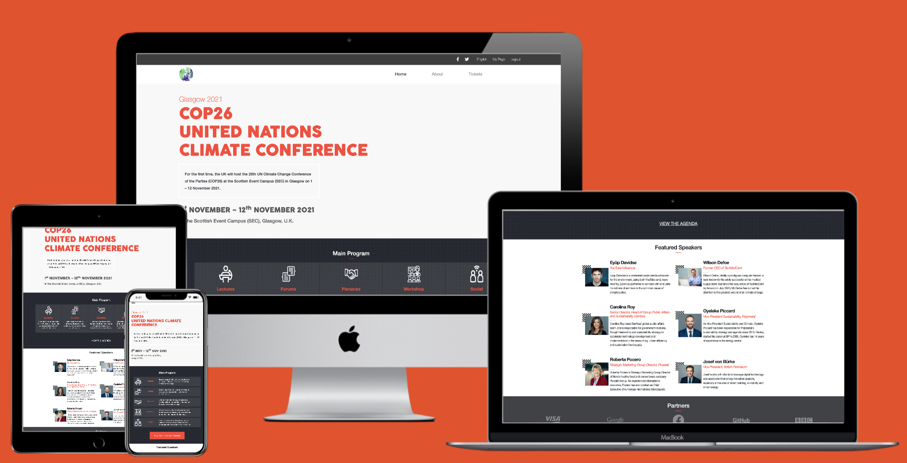

# HTML/CSS Capstone: COP26 UN Climate Conference

> This project is a website for the United Nations Climate Conference taking place in Glasgow in November 2021.

I was given [this design](https://www.behance.net/gallery/29845175/CC-Global-Summit-2015) of [Cindy Shin](https://www.behance.net/gallery/29845175/CC-Global-Summit-2015)'s to follow, mirroring its structure, typography and colors as I built my own conference website.

After some cursory research, I discovered that the next UN "Conference of the Parties" is due to take place in the UK next year, and I decided this would be the conference for which I would build my website.

## Video Presentation

Watch my video [presentation](https://www.loom.com/share/514053e38f0c48ba83010316a8c5b399) of the project to hear more about this assignment and how I approached it.

## Built With

- HTML/CSS
- Bootstrap
- SASS
- Stylelint, Webhint, Lighthouse
- VSCode (with Prettier, Stylelint and Live Server extensions)
- Google Chrome (with DevTools and Pesticide)
- MacOS

## Live Demo

See the project in action by visiting the [live demo](https://practical-lewin-9eb5ef.netlify.app/main.html)!

## Getting Started

**To get this project set up on your local machine, follow these simple steps:**

1. Open Terminal.

2. Navigate to your desired location to download the contents of this repository.

3. Copy and paste the following code into the Terminal:

    git clone https://github.com/Joseph-Burke/COP26-Conference-Page

4. Hit enter.

5. Once the repository has been cloned, open main.html in a browser of your choosing. From there, you may also navigate to the "About" and "Tickets" pages.

6. Enjoy!

### Prerequisites

- A computer, a smartphone, or another similar device.
- Access to the internet.

## Author

👤 **Joe Burke**

> Hello, World! 

> My name's Joe. Hire me!

- Github: [@Joseph-Burke](https://github.com/Joseph-Burke)
- Twitter: [@__joeburke](https://twitter.com/__joeburke)
- LinkedIn: [Joseph Burke](https://www.linkedin.com/in/joseph-burke-b7a8261a5)

## 🤝 Contributing

Contributions, issues and feature requests are always welcome!

I love meeting other developers, especially ones that give me advice on how to improve my work.

Drop me an [issue](issues/)!

## Show your support

Finally, if you've read this far, don't forget to give this repo a ⭐️. They're free . . . I think.

## Acknowledgments

- Thanks are owed to the designer, [Cindy Shin](https://www.behance.net/gallery/29845175/CC-Global-Summit-2015), for her design.
- Thanks to [techsini.com](https://techsini.com/multi-mockup/) for their useful URL-based website mockup tool.
- Content was largely inspired by [this](https://www.worldclimatesummit.org/copy-of-speakers-2019-1) website, which lists speakers at the Investment COP in Glasgow on the 7th-8th November 2021. The text has been adapted and the names have been changed.
- Headshots of fictional guest speakers were taken from [this](https://www.worldclimatesummit.org/copy-of-speakers-2019-1) website.
- Speaker names were adapted from the names of the members of my Stand-Up Team: Amita, Oyeleke, Brandon, Robert, Sercan and myself. As always, thanks go to them for their feedback and support.
- Icons were taken from www.flaticon.com with the request that they be attributed to their creators:

Icons made by <a href="https://www.flaticon.com/authors/pixel-perfect" title="Pixel perfect">Pixel perfect</a> from
      <a href="https://www.flaticon.com/" title="Flaticon">www.flaticon.com</a>

    
Icons made by <a href="https://www.flaticon.com/authors/eucalyp" title="Eucalyp">Eucalyp</a> from <a
        href="https://www.flaticon.com/" title="Flaticon">www.flaticon.com</a>

    
Icons made by <a href="https://www.flaticon.com/authors/smashicons" title="Smashicons">Smashicons</a> from <a
        href="https://www.flaticon.com/" title="Flaticon">www.flaticon.com</a>

    
Icons made by <a href="https://www.flaticon.com/authors/freepik" title="Freepik">Freepik</a> from <a
        href="https://www.flaticon.com/" title="Flaticon">www.flaticon.com</a>

    
Icons made by <a href="https://www.flaticon.com/authors/bqlqn" title="bqlqn">bqlqn</a> from <a
        href="https://www.flaticon.com/" title="Flaticon">www.flaticon.com</a>

## 📝 License

This project is [MIT](lic.url) licensed.
